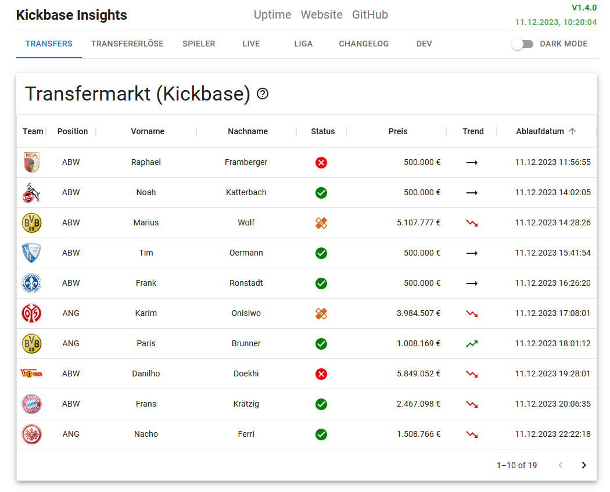
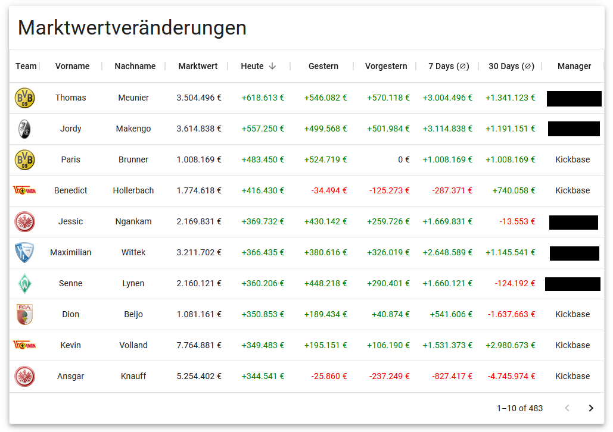
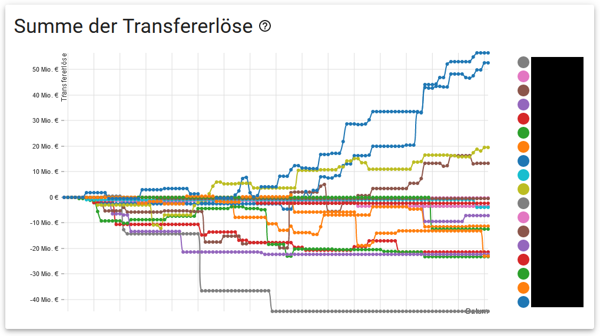
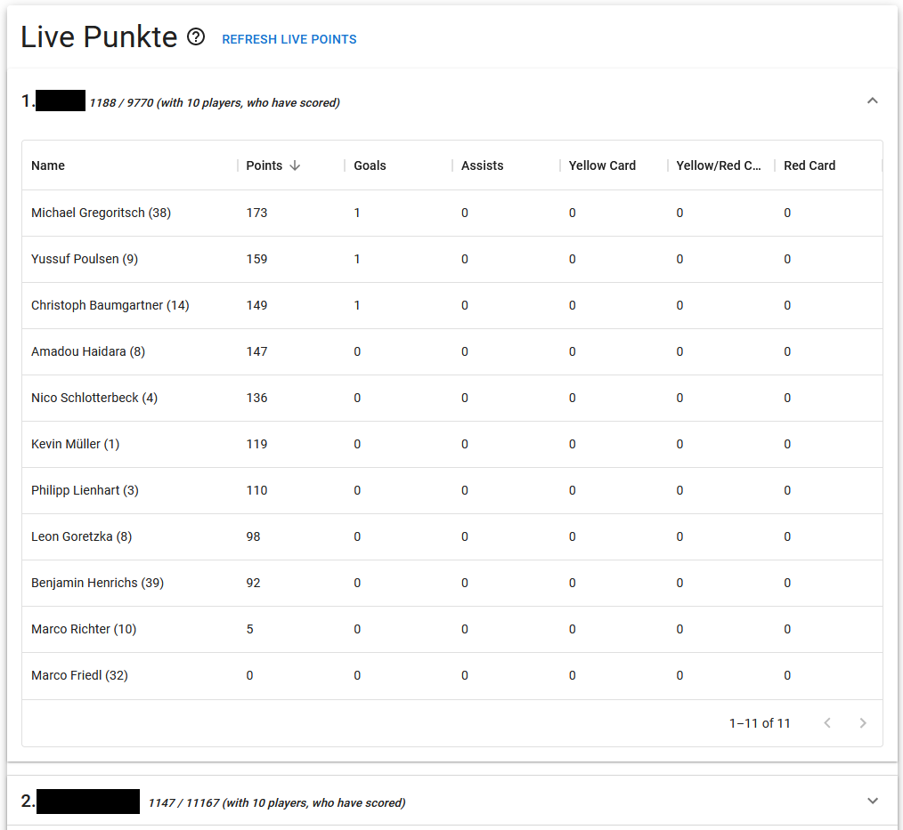

<div align="center">
  <a href="https://de.kickbase.com/"></a>
  <br>
  <h1>Kickbase Insights</h1>
  This project is a used to gather data from <a href="https://www.kickbase.com/">Kickbase</a> API endpoint and visualize it in a web interface, acting as alternative for the pro/member membership.

  ---

  <!-- Placeholder for badges -->
   


</div>

> Note: This is a hobby project to test stuff with JSON and the cores of Python. Feel free to create issues and contribute.  

##### Table of Contents
- [Screenshots](#screenshots)
- [Docker](#docker)
  - [docker run](#docker-run)
  - [Docker Compose](#docker-compose)
- [Local usage](#local-usage)
    - [Prerequisites](#prerequisites)
    - [Installation](#installation)
- [Development](#development)
- [Planned for the future](#planned-for-the-future)
- [Thanks to](#thanks-to)
- [License](#license)

---

## Screenshots
You can find some screenshots of the frontend below, not all features are shown.  

> :information_source: As of v1.4.0  

  
  
  
  

## Docker
If you want to run this in a Docker container, you'll first need to set some mandatory environment variables:  

| Variable | Required | Description |
| --- | --- | --- |
| `KB_MAIL` | **Yes** | Your Kickbase E-Mail. |
| `KB_PASSWORD` | **Yes** | Your Kickbase password. |
| `DISCORD_WEBHOOK` | **Yes** | The Discord webhook URL to send notifications to. |
| `RUN_SCHEDULE` | No | The cron expression when the script should fetch new information from the API. If not set, defaults to `10 2,6,10,14,18,22 * * *`. |
| `WATCHPACK_POLLING` | **Yes** | Used to [apply new changes](https://stackoverflow.com/a/72661752) in the filesystem on runtime. If not set, defaults to `true`. |

### docker run
```bash
docker run -d \
    --name=kickbase_insights \
    --restart=unless-stopped \
    -p <frontend_port>:3000 -p <backend_port>:5000 \
    -e KB_MAIL=<kickbase_email> \
    -e KB_PASSWORD=<kickbase_password> \
    -e DISCORD_WEBHOOK=<discord_webhook> \
    -e RUN_SCHEDULE=<your_schedule> \ 
    -e WATCHPACK_POLLING=true \
    ghcr.io/casudo/kickbase-insights:<tag>
```  

### Docker Compose
```yaml
version: "3.8"

services:
  kickbase-insights:
    image: ghcr.io/casudo/kickbase-insights:<tag>
    container_name: kickbase_insights
    restart: unless-stopped
    ports:
      - <frontend_port>:3000 # Frontend
      - <backend_port>:5000 # Backend API
    environment:
        - KB_MAIL=<kickbase_email>
        - KB_PASSWORD=<kickbase_password>
        - DISCORD_WEBHOOK=<discord_webhook>
        - RUN_SCHEDULE=<your_schedule>
        - WATCHPACK_POLLING=true
```  

If you run this container in your LAN (via IP), you'll need to change the following line in the `App.js` file in the `frontend/src` folder to this (obv. change `<backend_port>`):     
```js
const response = await fetch('http://localhost:<backend_port>/api/livepoints')
```  

If you make this container publically available via a domain, you'll need to create/update the following entry in your reverse proxy:  
`your.domain.com -> <container_ip_or_hostname>:3000`  
`your.domain.com/api/livepoints -> <container_ip_or_hostname>:5000`  
> Note: In order to this to work, both your reverse proxy and the container need to be in the same network.  

> Additional note: It may take some time to first run the container, so check the logs!  

---

## Local usage
> :warning: **Outdated and not recommended as of v1.4.0!**  

To run Kickbase Insights on your local machine, you can follow the steps described below.  

### Prerequisites
- Python 3.X
- Pip
- Node.js
- NPM

### Installation
1. Download a release from the [releases page](https://github.com/casudo/Kickbase-Insights/releases) or clone the repository  
2. (Optional): Create a virtual environment for the python dependencies  
3. Install the python dependencies with `pip install -r requirements.txt`  
4. Run `main.py` with the required arguments (see below)  
    - To get a list of the required arguments, run `python main.py --help`  
5. Run the following commands in the `frontend` folder:  
    - `npm install`  
    - `npm start`  
6. Visit the GUI at `localhost:3000`  

---

## Development
If you want to contribute to this project, you can follow the steps below to start the development environment.  
```bash
docker run -dit --name=Kickbase -p <frontend_port>:3000 -p <backend_port>:5000 -e KB_MAIL=<kickbase_mail> -e KB_PASSWORD=<kickbase_password> -e DISCORD_WEBHOOK=<discord_webhook> -e WATCHPACK_POLLING=true ubuntu
```  
Run this long command to setup the container:  
```bash
mkdir /code && cd /code && apt update && apt upgrade -y && apt install tree nano python3 pip nodejs npm git -y && git clone https://github.com/casudo/Kickbase-Insights.git . && pip install -r requirements.txt && mkdir -p frontend/src/data/timestamps && mkdir logs && cd frontend && npm install
```  

Now you're ready to go. Keep in mind that you'll first need to run `main.py` to get the required data for the frontend.  

You'll also need to manually run `npm start` in the `frontend` folder as well as `python3 -u -m flask run --host=0.0.0.0 --port=5000` in the `/code` folder.  

---

## Planned for the future
**Frontend:**  
- Market table: Maybe add ligainsider rating?
- Add base features
  - Feed
  - Lineup
  - Battles
  - Next matches
  - League table
  - Top players
- Transfererlöse: Hold player for X days  
- Sum. Transfererlöse: Add custom scale for chart  
- Dev: Execution time  
- Misc: Unsold starter players    
- Display version from container image version   
- Fix TZ on frontend (market table)  
- Reformat changelog  
- Other menu layout (+ mobile responsive)  
- Back to top button  
- ToC on pages with lot of content  
- Market value graph for players  

**Backend:**  
- Fix all TODOs  
- Measure time of API calls and display them under Misc?  
- Add best practice to seperate duplicate variables names from modules (e.g. user and user. Which one is the module and which one is the variable?)  
- Fix TZ in Ubuntu image ([Stackoverflow](https://serverfault.com/questions/683605/docker-container-time-timezone-will-not-reflect-changes))  
- Discord notifications  
- Logging module for entrypoint.py and app.py    
- Add linter/formatter  
- Categorize components to frontend menu  
- Better performance for some API calls (e.g. taken/free players)  
- Remove argparse  

**Misc:**  
- Add Postman workspace  
- Add Workflow chart  
- Add ./data, ./data/timestamp and logs/ folders to git  
- Automatically disable caching  

---

### Thanks to
- [@fabfischer](https://github.com/fabfischer) for the inspiration and the currently great and working [Kickbase+ web client](https://github.com/fabfischer/kickbase-plus)  
- [@kevinskyba](https://github.com/kevinskyba) for providing the excellent [Kickbase API documentation](https://kevinskyba.github.io/kickbase-api-doc)  
- [@roman-la](https://github.com/roman-la) for the base of the frontend  

---

### License
This project is licensed under the MIT License - see the [LICENSE](LICENSE) file for details